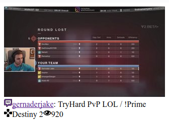

# react-twitch-user-status

Simple React component for displaying Twitch.tv's user status



You will need to have Twitch Client ID to access API.
If you don't have one:
1. login to Twitch.tv
2. go to [connections](https://www.twitch.tv/settings/connections)
3. create an app


### Depedencies

- jQuery (for jsonp request)

### Usage

```html
<TwitchUserStatus username="gernaderjake" livePoll={5000} twitchClientId="YOUR_TWITCH_CLIENT_ID" />
